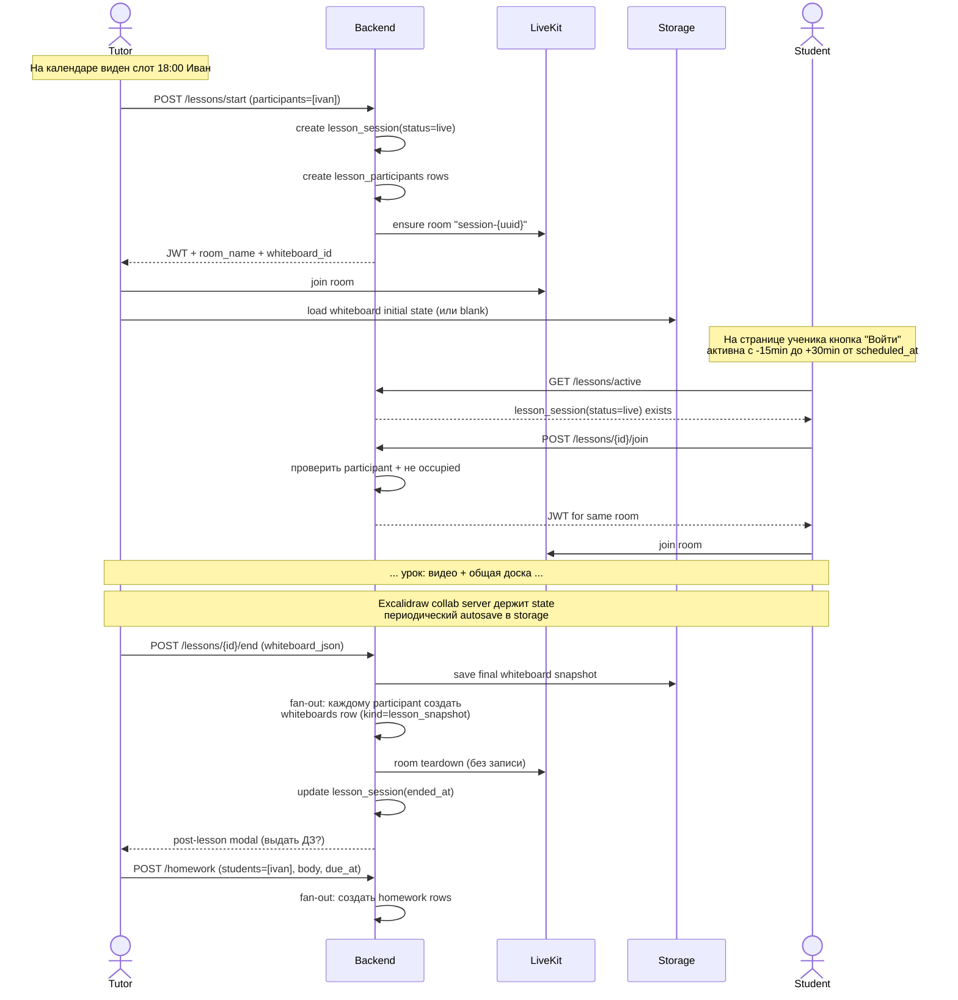

# Tutoring Platform — план

Сайт-платформа для репетитора и учеников. Старт — для себя + девушка-репетитор, затем подписочная модель для других репетиторов.

> **База:** архитектура `~/repos/bes` подходит как шаблон — слои чистые (`models / schemas / repositories / services / api`), мирроринг `<type>/<calculation>` ложится на `<role>/<feature>`. Берём шаблон, выкидываем `packages/slab/*`, оставляем `packages/core/` для общих утилит.

---

## 0. Стек

| Слой | Выбор | Почему |
|---|---|---|
| Backend | FastAPI + SQLAlchemy 2 + Alembic + Postgres | Как в bes — переиспользуем твой опыт. |
| Frontend | React + Vite + Mantine v8 + Zustand | Как в bes. |
| Видео | **LiveKit самостоятельно** (без Matrix-обёртки) | Бэк выдаёт JWT, комната живёт только во время урока. |
| Whiteboard | **Excalidraw** (self-hosted + collab server) | Open-source, отлично для математики/чертежей. |
| Файлы / медиа | **Локальная FS** в MVP → S3 (Yandex Object Storage) позже | Через `services/storage.py` абстракцию: переключение env-переменной. |
| Очереди | Redis + arq | Превью видео, нотификации, бэкапы. |
| **Чат / мессенджер** | **Matrix (Synapse) + FluffyChat** | Параллельный side-channel, ad-hoc общение учитель↔ученик. **Не часть платформы уроков.** Native iOS app решает проблему push-уведомлений. |
| Деплой | Docker Compose → Yandex Cloud | По стопам bes. |

**Принципиальное решение по архитектуре:** Matrix — НЕ платформа уроков. Уроки (видео + доска) полностью на сайте (LiveKit + Excalidraw). Matrix живёт сбоку как замена Telegram: учитель и ученик общаются там по жизни. На поздних фазах появится бот, который шлёт системные уведомления в DM-комнату. До бота — учитель пишет вручную.

**Что НЕ делаем в MVP:** свой видео-сервер, свой WYSIWYG, микросервисы, мобильное приложение, прокторинг, E2E шифрование, **запись видео уроков** (только снапшот доски + private-заметки учителя), мульти-тенантность (фокус — твой собственный сайт + сайт девушки).

**Storage strategy:** все файлы (материалы, attachments, снапшоты досок) идут через интерфейс `services/storage.py`. MVP-реализация `LocalFileStorage` пишет в `/var/lib/parta/storage/{key}`, выдача — через FastAPI streaming endpoint с auth-проверкой. Реализация `S3Storage` через `aioboto3` — на потом. Переключение env-переменной `STORAGE_BACKEND=local|s3`. Никогда не пишем пути к диску напрямую в сервисах/API.

**Приоритет фаз:** сначала рабочий сайт для тебя и твоей девушки (фазы 1-7). Мульти-тенантность, custom domains, биллинг — фаза 10, только после того как продукт реально работает в боевом использовании у вас двоих.

---

## 1. Роли и доступы

```
tutor    — полный CRUD по своим ученикам/материалам/урокам
student  — read свои материалы, submit ДЗ, прохождение тестов
admin    — только ты, управление подписками других репетиторов (позже)
```

Permissions через **resource ownership**: `tutor_id` поле в каждой таблице где это имеет смысл. JWT хранит только `user_id` + `role`, права проверяются по факту владения. Связь учитель↔ученик — таблица `tutor_student_links` с метаданными (ставка, политика отмен).

---

## 2. Ключевая ментальная модель: student-centric workspace

Это **главное решение** архитектуры. Прочитай внимательно — от него зависит вся БД и UI.

### Идея

- **У ученика нет "комнат". Есть один Workspace.** Это просто `student_id` — фильтр для всего его контента. UI ученика — единый dashboard: его доски, его записи уроков, его ДЗ, его материалы, его прогресс по тестам.
- **Урок — это event, а не место.** `lesson_sessions` — запись о факте состоявшегося урока. `lesson_participants` — кто участвовал. LiveKit-комната живёт только во время звонка и умирает, когда все вышли. Persistent комнат нет.
- **Группа — не отдельная сущность, а просто список участников у одного `lesson_session`.** Никакой "групповой комнаты". В следующий раз учитель собирает группу заново (UI запоминает частые сочетания через `lesson_presets` — фича на потом).
- **Артефакты урока раздаются по participants (fan-out).** Конец урока → каждый ученик получает в свой workspace копию снапшота доски + ссылку на запись. Каждый видит "свой" урок в своей ленте. Группа не означает разделяемые сущности — каждый владеет своей копией.

### Fan-out паттерн везде

| Действие учителя | Куда раздаётся |
|---|---|
| Завершил урок | snapshot доски + recording → каждому participant |
| Выдал ДЗ | `homework` row → выбранным ученикам |
| Выдал материал | `material_access` row → выбранным ученикам |
| Создал тест | `test_access` row → выбранным ученикам |

Один и тот же UI-паттерн "list-picker → создаётся N записей" используется для всего. Бэк один и тот же сервис `services/fanout.py`.

### Tutor — не имеет своего workspace

Учитель — оркестратор. Его UI — это:
1. **Dashboard**: "сегодня", "ждут проверки", "мои ученики" (плитки).
2. **Календарь**: все его уроки.
3. **Roster**: список учеников → клик → workspace ученика глазами учителя (read его контента + edit панель: назначить ДЗ, написать private-заметку, отметить прогресс).

---

## 3. Схема БД

```sql
users
├── id, email, password_hash, role (tutor|student|admin)
├── full_name, avatar_url, timezone
├── matrix_user_id (nullable), matrix_dm_room_id (nullable)
└── created_at, deleted_at

tutor_profiles
├── user_id (FK), bio, subjects[], hourly_rate
└── default_cancellation_policy (jsonb)

student_profiles
├── user_id (FK), grade_level, parent_contact
└── private_notes_md         -- видны только учителю

tutor_student_links            -- кто чей ученик
├── id, tutor_id, student_id, status
├── started_at, custom_rate, custom_policy
└── matrix_dm_room_id (nullable)

subjects
├── id, tutor_id, name, description, color

-- Materials --
materials
├── id, tutor_id, subject_id, title, body_md
├── visibility (private|assigned|public_in_subject)
├── version, parent_id (для версий/иерархии)

material_attachments
├── id, material_id, kind (video|pdf|image|link)
├── storage_key, original_filename, size_bytes
└── duration_sec, thumbnail_key

material_access                -- fan-out выдачи материала
├── material_id, student_id, granted_at

-- Tests --
tests
├── id, material_id, title, passing_score
├── time_limit_sec, shuffle_questions

questions
├── id, test_id, kind (single|multi|text|numeric)
├── body_md, points, explanation_md, order_index

answer_options
├── id, question_id, body_md, is_correct, order_index

test_attempts
├── id, test_id, student_id, started_at, finished_at
├── score, passed, answers_jsonb

-- Lessons (event-based, не "комнаты") --
lesson_sessions
├── id, tutor_id, subject_id
├── kind (one_to_one|group)
├── scheduled_at, started_at, ended_at, duration_min
├── status (scheduled|live|completed|cancelled|no_show)
├── livekit_room_name           -- "session-{uuid}", создаётся при start
├── tutor_notes_md (private)
├── price_snapshot, is_paid, paid_at
└── cancellation_reason, cancelled_by, cancelled_at

lesson_participants            -- fan-out: кто был в уроке
├── lesson_id, student_id
├── joined_at, left_at, attended
└── cancellation_notified_at

-- Whiteboards (всегда принадлежат ученику) --
whiteboards
├── id, owner_student_id        -- ВЛАДЕЛЕЦ — ученик, не урок
├── source_lesson_id (nullable) -- если из урока — какого
├── kind (lesson_snapshot|personal_scratch)
├── title, storage_key (S3 .excalidraw json)
├── thumbnail_key, created_at, last_edited_at
└── locked (read-only для архивных снапшотов)

-- Homework --
homework
├── id, student_id, tutor_id
├── source_lesson_id (nullable), source_material_id (nullable)
├── title, body_md, due_at
├── status (assigned|submitted|graded|overdue)
└── grade, tutor_feedback_md

homework_submissions
├── id, homework_id, body_md, submitted_at
└── attachments (jsonb of storage_keys)

-- Calendar / scheduling --
calendar_events                -- generic слоты (для блокировки времени без урока)
├── id, tutor_id, starts_at, ends_at, kind, title

-- Cancellation tracking --
cancellation_policy_violations
├── id, link_id (tutor_student_link), lesson_id
├── notified_at, hours_before_lesson
└── counts_toward_strike

-- Lesson presets (фича на потом) --
lesson_presets
├── id, tutor_id, name, student_ids[]
└── default_duration, default_subject_id

-- Audit --
audit_log
├── id, user_id, action, target_type, target_id
├── payload_jsonb, created_at
```

**Индексы:** все FK; `lesson_sessions (tutor_id, scheduled_at)` для календаря; `lesson_sessions (status, scheduled_at)` для "какие уроки сейчас live"; `homework (student_id, status, due_at)` для дашборда ученика; `whiteboards (owner_student_id, created_at desc)`.

---

## 4. Структура репо (по шаблону bes)

```
backend/
  app/
    api/
      auth.py
      tutor/
        students.py
        materials.py
        lessons.py            # start/end/list
        homework.py
        roster.py
      student/
        workspace.py          # единая точка - "мой кабинет"
        homework.py
        tests.py
      shared/
        calendar.py
        whiteboards.py
        livekit_tokens.py
    schemas/
      tutor/
      student/
      shared/
    models/
    repositories/
      users.py, materials.py, lessons.py
      homework.py, tests.py, whiteboards.py
    services/
      auth.py
      lessons.py              # start/end + fan-out
      fanout.py               # generic fan-out утилиты
      whiteboards.py
      livekit.py              # JWT token generation
      storage.py              # S3 wrappers
      matrix_bot.py           # ПОЗЖЕ — уведомления
    core/
      config.py, database.py, security.py, limits.py
    integrations/
      livekit_client.py
      excalidraw_storage.py
      matrix_client.py        # позже
packages/
  core/                       # общие чистые утилиты
    cancellation_rules/        # чистая логика, unit-testable
    timeparsing/
    grading/                   # автоматическая проверка тестов
frontend/
  src/
    api/
    pages/
      tutor/
        DashboardPage.tsx
        CalendarPage.tsx
        StudentPage.tsx        # просмотр workspace ученика
        LessonRoomPage.tsx     # урок (видео + доска)
      student/
        WorkspacePage.tsx      # МОЙ КАБИНЕТ - единая страница
        LessonRoomPage.tsx     # тот же урок (роль другая)
      shared/
        LoginPage.tsx, ProfilePage.tsx
    components/
      lesson/
        VideoSidebar.tsx       # LiveKit панель
        WhiteboardCanvas.tsx   # Excalidraw обёртка
        LessonControls.tsx
      workspace/
        HomeworkList.tsx
        WhiteboardGallery.tsx
        LessonHistory.tsx
      tutor/
        ParticipantPicker.tsx  # list-picker для fan-out
        StudentRoster.tsx
    stores/
    types/
```

---

## 5. Lesson lifecycle (главный поток)



**Сигнал "урок начался" для ученика:**
- MVP: кнопка "Войти" активна по расписанию (±15min/+30min) — UX предсказуемо без real-time.
- Дополнительно: polling `/api/lessons/active` каждые 10с — если учитель стартовал — кнопка горит зелёным.
- Позже: WebSocket push для мгновенной активации.
- Ещё позже: Matrix-бот шлёт в FluffyChat уведомление "урок начался".

---

## 6. UI макеты страниц

### 6.1. Student Workspace (главная страница ученика)

```
┌──────────────────────────────────────────────────────────────────┐
│  TutorPlatform           Иван П. (ученик)            🔔  👤  ⚙   │
├──────┬───────────────────────────────────────────────────────────┤
│      │                                                           │
│ 🏠   │  Сегодня                                                  │
│      │  ┌─────────────────────────────────────────────────────┐  │
│ 📅   │  │ 🔴 LIVE  18:00  Алгебра с Анной       [▶ Войти]    │  │
│      │  └─────────────────────────────────────────────────────┘  │
│ 📚   │                                                           │
│      │  Активные ДЗ (2)                                          │
│ ✏️   │  ┌─────────────────────────────────────────────────────┐  │
│      │  │ Глава 3, задачи 1-5         до 25.05  [Открыть]    │  │
│ 🎨   │  │ Тест по производным         до 27.05  [Пройти]     │  │
│      │  └─────────────────────────────────────────────────────┘  │
│ 📋   │                                                           │
│      │  Прошлые уроки                                            │
│      │  ┌─────────────────────────────────────────────────────┐  │
│      │  │ 21.05  Алгебра    Анна    [доска] [заметки уч-ля]   │  │
│      │  │ 19.05  Алгебра    Анна    [доска]                   │  │
│      │  │ 16.05  Физика     Анна    [доска]                   │  │
│      │  └─────────────────────────────────────────────────────┘  │
│      │                                                           │
│      │  Мои доски                              [+ Новая личная] │
│      │  ┌─────┐ ┌─────┐ ┌─────┐ ┌─────┐                         │
│      │  │📌 21│ │📌 19│ │✏️ моя│ │📌 16│  ...                    │
│      │  │ снап│ │ снап│ │ scrat│ │ снап│                         │
│      │  └─────┘ └─────┘ └─────┘ └─────┘                         │
│      │                                                           │
│      │  Материалы                                                │
│      │  · 📄 Производные.pdf   · 🎥 Метод подстановки.mp4         │
└──────┴───────────────────────────────────────────────────────────┘
```

Боковое меню: 🏠 главная · 📅 календарь · 📚 материалы · ✏️ ДЗ · 🎨 доски · 📋 тесты

### 6.2. Tutor Dashboard

```
┌──────────────────────────────────────────────────────────────────┐
│  TutorPlatform           Анна К. (репетитор)         🔔  👤  ⚙   │
├──────┬───────────────────────────────────────────────────────────┤
│      │                                                           │
│ 🏠   │  Сегодня, четверг 22 мая          [+ Начать урок сейчас] │
│      │  ┌─────────────────────────────────────────────────────┐  │
│ 📅   │  │ 18:00  Иван П.       Алгебра      [▶ Начать]       │  │
│      │  │ 19:30  Группа Б11    Алгебра (3)  [▶ Начать]       │  │
│ 👥   │  │ 21:00  Маша К.       Физика       [▶ Начать]       │  │
│      │  └─────────────────────────────────────────────────────┘  │
│ 📚   │                                                           │
│      │  Ждут проверки (3)                                        │
│ ✏️   │  ┌─────────────────────────────────────────────────────┐  │
│      │  │ Иван   ДЗ "Глава 3"        сдано вчера [Проверить] │  │
│ 📊   │  │ Пётр   Тест "Производные"  сдан 2 дня  [Проверить] │  │
│      │  │ Маша   ДЗ "Силы трения"    сдано сейчас[Проверить] │  │
│      │  └─────────────────────────────────────────────────────┘  │
│      │                                                           │
│      │  Мои ученики (8)                       [+ Добавить]       │
│      │  ┌──────────┐ ┌──────────┐ ┌──────────┐ ┌──────────┐    │
│      │  │ Иван П.  │ │ Пётр А.  │ │ Маша К.  │ │ Катя Б.  │    │
│      │  │ Алгебра  │ │ Физика   │ │ Физика   │ │ Алгебра  │    │
│      │  │ 3 ДЗ ⚠   │ │ 1 ДЗ     │ │ 2 ДЗ     │ │ всё ок ✓ │    │
│      │  └──────────┘ └──────────┘ └──────────┘ └──────────┘    │
│      │                                                           │
└──────┴───────────────────────────────────────────────────────────┘
```

Боковое меню: 🏠 · 📅 календарь · 👥 ученики · 📚 материалы · ✏️ ДЗ · 📊 статистика

### 6.3. Lesson Room (видео + доска, общая страница для учителя и ученика)

```
┌──────────────────────────────────────────────────────────┬───────┐
│ ← Завершить урок    Алгебра / Иван   ⏱ 18:14 / 60min    │ Анна  │
├──────────────────────────────────────────────────────────┤ █████ │
│ [✏️] [□] [◯] [→] [T] [↶] [↷] [📋]  ← Excalidraw toolbar │ █████ │
│                                                          │ говорит│
│                                                          ├───────┤
│                                                          │ Иван  │
│                                                          │ █████ │
│            EXCALIDRAW canvas (общий)                     │ █████ │
│         совместная работа в realtime                     │       │
│                                                          ├───────┤
│                                                          │ 🎤 📹 │
│                                                          │ 🖥 ⚙  │
│                                                          │  📞   │
│                                                          ├───────┤
│                                                          │ [‹‹]  │
│                                                          │ свер- │
│                                                          │ нуть  │
└──────────────────────────────────────────────────────────┴───────┘
                                                          ↑
                                       Свёрнутая боковая (40px):
                                       ┃ ●Анна ●Иван 🎤📹📞 ┃
```

Сайдбар сворачивается в узкую полоску (40px) когда учитель активно рисует.

### 6.4. Tutor → "Начать урок" модал (participant picker)

```
┌─────────────────────────────────────────────┐
│  Начать урок                          [✕]   │
├─────────────────────────────────────────────┤
│  Из расписания (±15 мин):                   │
│  ☑ Иван П.   18:00 Алгебра                  │
│                                             │
│  Все ученики:                               │
│  ☑ Иван П.        Алгебра                   │
│  ☐ Пётр А.        Физика                    │
│  ☐ Маша К.        Физика                    │
│  ☐ Катя Б.        Алгебра                   │
│                                             │
│  Или из preset:                             │
│  [Группа Б11 ▼]                              │
│                                             │
│  Предмет: [Алгебра ▼]   Длительность: [60м] │
│                                             │
│              [Отмена]  [▶ Начать урок]      │
└─────────────────────────────────────────────┘
```

После завершения урока — аналогичный модал "Выдать ДЗ?" с тем же list-picker.

### 6.5. Tutor → Workspace ученика (взгляд "глазами учителя")

```
┌──────────────────────────────────────────────────────────────────┐
│  ← Иван П.   Алгебра  ставка 1500₽       [Начать урок] [ДЗ]     │
├──────────────────────────────────────────────────────────────────┤
│  [Уроки] [ДЗ] [Доски] [Материалы] [Тесты] [Заметки private] [⚙] │
├──────────────────────────────────────────────────────────────────┤
│                                                                  │
│  Прогресс                                                        │
│  ──────────────────────────────────────────                      │
│  Уроков за месяц: 6     Посещаемость: 100%                       │
│  ДЗ сдано: 5/6          Тестов пройдено: 3 (ср. 87%)            │
│                                                                  │
│  Прошлые уроки (всё что было)                                    │
│  · 21.05  Алгебра   60 мин   [доска] [мои заметки]              │
│  · 19.05  Алгебра   60 мин   [доска]                            │
│  ...                                                             │
│                                                                  │
│  Activity feed                                                   │
│  · Сегодня 14:32   сдал ДЗ "Глава 3"                            │
│  · Вчера 18:00     завершил урок                                 │
│  · 20.05           прошёл тест 92%                               │
└──────────────────────────────────────────────────────────────────┘
```

### 6.6. Calendar (общий компонент для обеих ролей)

```
┌──────────────────────────────────────────────────────────────────┐
│  Май 2026               [<]  Неделя 19-25  [>]   [Месяц] [Неделя]│
├──────┬───────┬───────┬───────┬───────┬───────┬───────┬───────────┤
│      │  Пн19 │ Вт 20 │ Ср 21 │ Чт 22 │ Пт 23 │ Сб 24 │  Вс 25    │
├──────┼───────┼───────┼───────┼───────┼───────┼───────┼───────────┤
│ 17:00│       │       │       │       │       │       │           │
├──────┼───────┼───────┼───────┼───────┼───────┼───────┼───────────┤
│ 18:00│ Иван  │       │ Иван  │ Иван  │ Иван  │       │           │
│      │ 60м   │       │ 60м   │ 60м   │ 60м   │       │           │
├──────┼───────┼───────┼───────┼───────┼───────┼───────┼───────────┤
│ 19:00│       │       │       │       │       │       │           │
├──────┼───────┼───────┼───────┼───────┼───────┼───────┼───────────┤
│ 19:30│       │ Гр.Б11│       │ Гр.Б11│       │       │           │
│      │       │ (3)   │       │ (3)   │       │ Маша  │           │
│      │       │ 90м   │       │ 90м   │       │ 60м   │           │
└──────┴───────┴───────┴───────┴───────┴───────┴───────┴───────────┘
```

Клик на слот:
- Учитель: edit/delete event, "начать сейчас".
- Ученик: только просмотр; если урок live — кнопка "Войти".

---

## 7. Matrix как side-channel (фаза на потом)

**Роль:** замена Telegram. Постоянный DM "учитель ↔ ученик". Не связан с уроками платформы.

**Поток создания:**
1. При создании ученика на сайте бэк (опционально):
   - Создаёт Matrix-юзера через Synapse Admin API.
   - Создаёт DM-комнату учитель↔ученик.
   - Сохраняет `users.matrix_user_id` + `tutor_student_links.matrix_dm_room_id`.
2. Ученик ставит FluffyChat на телефон, логинится своими creds.
3. Учитель и ученик общаются в FluffyChat — переписка, файлы, голосовые.

**SSO учитель/ученик:** Synapse OIDC delegation → FastAPI auth. Один логин/пароль на сайт и Matrix. Документация Synapse чёткая, ~1-2 дня работы.

**Бот (поздняя фаза):** `services/matrix_bot.py` на `matrix-nio`. Шлёт в DM-комнаты:
- "Урок через 1 час"
- "Тебе выдано новое ДЗ: <ссылка>"
- "Преподаватель оценил твоё ДЗ"

Бот — **только исходящие нотификации**. Входящие команды (`!отменить`) — фича на отдалённое потом.

**Восстановление чата** (если ученик удалил FluffyChat / разлогинился) — вручную, нечасто, не страшно.

**Federation:** для MVP можно переиспользовать существующий edu-Synapse. Под подписочную модель — отдельный `tutor.домен`, иначе у клиентов чужой брендинг и риск утечек в личную инфру. Миграция = смена `homeserver` в Matrix-доменах, переподключение клиентов. Болезненно, но возможно.

---

## 8. LiveKit интеграция

```python
# services/livekit.py - псевдокод
def create_lesson_token(lesson_id: str, user_id: str, role: str) -> str:
    grant = VideoGrants(
        room=f"session-{lesson_id}",
        room_join=True,
        room_create=True if role == "tutor" else False,
        can_publish=True, can_subscribe=True,
    )
    return AccessToken(api_key, api_secret, identity=user_id).with_grants(grant).to_jwt()
```

- Бэк выдаёт JWT при `POST /lessons/{id}/join`.
- Frontend `<LiveKitRoom token={token}>` подключается напрямую к LiveKit серверу.
- **Запись урока не делаем** — только финальный снапшот доски + private-заметки учителя (см. секцию 15).
- Идентификатор комнаты = `session-{lesson_id}`, нет коллизий, легко grep'ать логи.

---

## 9. Excalidraw интеграция

- Self-host `excalidraw` (статика) + `excalidraw-room` (WebSocket для collab).
- На фронте: `@excalidraw/excalidraw` как React-компонент, не iframe.
- При входе в `LessonRoomPage`:
  - Подключение к `excalidraw-room` с room ID = `lesson-{lesson_id}`.
  - Загрузка initial state из S3 (если есть) или blank.
- Autosave: каждые 30с → `PUT /api/whiteboards/autosave/{lesson_id}` → storage (через абстракцию).
- Завершение урока → final save → fan-out copy в whiteboards каждого participant.
- В workspace ученика: открытие старой доски → загрузка из storage, доска **locked=true** (read-only).

**Почему не tldraw:** с tldraw SDK 4.0 (сентябрь 2025) commercial license — $6k/год за команду. Hobby license дискреционная, под подписочный продукт не выдадут. Excalidraw MIT — никаких лицензионных ограничений, self-host без условий.

**Личные scratch-доски** — отдельный whiteboard (`kind=personal_scratch`, `source_lesson_id=null`). Не привязан к уроку. Ученик может рисовать когда угодно.

---

## 10. Правило отмен (бизнес-логика)

> "Не сообщил 2 раза за месяц более чем за 2 дня до урока — деньги остаются у учителя"

Реализация в `packages/cancellation_rules/` — чистая функция:

```python
def evaluate_cancellation(
    lesson_starts_at: datetime,
    cancelled_at: datetime,
    student_history: list[ViolationSnapshot],
    policy: CancellationPolicy,
) -> CancellationVerdict:
    hours_before = (lesson_starts_at - cancelled_at).total_seconds() / 3600
    if hours_before >= policy.min_hours_before:  # default 48
        return CancellationVerdict(refund=True, counts_as_strike=False)
    recent_strikes = count_strikes_in_window(student_history, days=30)
    if recent_strikes >= policy.max_strikes_per_month:  # default 2
        return CancellationVerdict(
            refund=False, counts_as_strike=True,
            reason="exceeded_monthly_strikes"
        )
    return CancellationVerdict(refund=True, counts_as_strike=True)
```

Никаких БД-обращений внутри — только данные. Unit-тесты тривиальны (свыше 95% покрытие). Сервис `services/lessons.py` дёргает её и пишет результат в `cancellation_policy_violations` + `audit_log`.

Политика per-link (override) либо дефолт из `tutor_profiles`.

---

## 11. Google Calendar интеграция (фазы)

Поэтапный подход: локальный → односторонний write → двусторонний sync. Каждый шаг — incremental, без переписывания.

**Отвергнутые варианты:**
- **iCal subscription (ICS feed):** Google рефрешит подписки раз в 12-24ч, контролировать нельзя — троттлинг на стороне Google. Не годится для оперативного отображения изменений.
- **CalDAV:** с февраля 2025 Google CalDAV — read-only. Писать в Google через CalDAV нельзя.

### Фаза 0 — локальный календарь (MVP)
Свой UI на FullCalendar.js, события в `lesson_sessions` / `calendar_events`. Никакой внешней интеграции. Source of truth — БД сайта.

### Фаза A — односторонняя запись в Google (после MVP, ~3-5 дней)
- Tutor один раз даёт OAuth-доступ → бэк хранит refresh token в `google_calendar_credentials(tutor_id, refresh_token, calendar_id)`.
- Сайт остаётся source of truth. При create/update/delete урока — бэк дёргает `events.insert/patch/delete` через Google Calendar API.
- Изменения в Google появляются за 1-2 секунды.
- One-time backfill при первом подключении: идемпотентный `sync_all_lessons_to_google(tutor_id)`.
- Минус: правки в Google → на сайте не подхватятся. Tutor должен править на сайте.

### Фаза B — двусторонняя синхронизация (опционально, при росте, +1.5-2 недели)
- Google → сайт через **push notifications** (`events.watch` + webhook `/webhooks/google-calendar`).
- Sync tokens для инкрементальной выгрузки (`syncToken` в `events.list`).
- Watch channels гаснут раз в 7 дней → arq job на renewal раз в 6 дней.
- Periodic full sync на случай дропа уведомлений (Google docs: "not 100% reliable").
- **Conflict resolution policy** — решать когда дойдём. Дефолт: last-write-wins по `updated_at`, либо "сайт всегда побеждает для уроков, Google — для generic блоков".

### Что заложить в фазе 0 чтобы A/B встроились без переписывания

1. **Сервисный слой как единая точка.** Все мутации календаря/уроков — через `services/calendar.py` и `services/lessons.py`, НИКОГДА из API напрямую в repo. Тогда добавление Google в фазе A — +1 строка внутри сервиса:
   ```python
   def create_lesson(...):
       lesson = repo.create(...)
       google_sync.maybe_push(lesson)  # no-op если tutor не подключил Google
       return lesson
   ```
2. **Поле `google_event_id` nullable** в `lesson_sessions` и `calendar_events` с самого начала. Ноль усилий сейчас, избавляет от миграции на больших данных потом.
3. **Таймзоны явно.** `users.timezone` (IANA: `Europe/Moscow`). В БД — UTC. Конвертация только на границе API. Google API строго требует RFC3339 с tz — если намешаешь naive datetime, в фазе A будет день переписывания.
4. **Идемпотентный `google_sync.push_lesson(lesson)`** с первого дня фазы A: если `google_event_id` стоит — update, иначе insert. Один код работает и для новых уроков, и для backfill старых.

### Чего НЕ делать заранее
- НЕ писать абстрактный `CalendarProvider` интерфейс с `LocalProvider`/`GoogleProvider` "на будущее". Один провайдер локально, один Google потом — две строчки кода, не паттерн. Premature abstraction только усложнит чтение.

---

## 12. Подписочная модель (для шага "продавать другим репетиторам")

- **Tenancy:** shared DB + `tutor_id` фильтр в каждом запросе. Простейший вариант. Application-level фильтр через middleware.
- **Schema-per-tenant** или отдельная БД — НЕ сейчас, только если будут крупные клиенты с регуляторными требованиями.
- **Тарифы** (по аналогии с `bes/core/limits.py`):
  - max students per tutor
  - max storage GB
  - max group lesson size
  - AI-фичи on/off (автогенерация тестов и т.п.)
  - matrix-бот on/off (на бесплатном тарифе — без бота)
- **Биллинг:** ЮKassa / CloudPayments (для РФ). Webhook → `services/billing.py` → обновляет `subscription_tier`.

---

## 13. Дорожная карта по фазам

### Фаза 0 — Setup (1-2 дня)
- [ ] Склонировать структуру bes как стартовый шаблон
- [ ] Почистить от slab/static
- [ ] Поднять Postgres + Redis (или Valkey — pure FOSS) в docker-compose
- [ ] Создать `/var/lib/parta/storage/` для локального хранилища + `services/storage.py` с интерфейсом `Storage` и реализацией `LocalFileStorage`
- [ ] Базовый CI (ruff + mypy + pytest)

### Фаза 1 — Auth и пользователи (1 неделя)
- [ ] Регистрация репетитора + email-подтверждение
- [ ] Создание учеников учителем (одноразовый токен; учитель задаёт пароль вручную или генерит)
- [ ] JWT (access+refresh), profile management

### Фаза 2 — Materials и доступы (1-2 недели)
- [ ] CRUD материалов с markdown-редактором (TipTap или MDXEditor)
- [ ] Загрузка файлов в S3, signed URLs для скачивания
- [ ] Видео: загрузка + ffmpeg в arq-задаче генерит превью
- [ ] Fan-out выдачи материала ученикам (list-picker UI)
- [ ] Версионирование (parent_id)

### Фаза 3 — Tests (1 неделя)
- [ ] Конструктор теста
- [ ] Прохождение + автогрейдинг single/multi/numeric
- [ ] Ручная проверка text-вопросов
- [ ] История попыток в workspace ученика

### Фаза 4 — Calendar + lesson lifecycle (2 недели) **← главная фаза**
- [ ] Календарь учителя (свободные слоты, регулярные уроки)
- [ ] **lesson_sessions + lesson_participants** схема
- [ ] LiveKit интеграция + JWT-токены (`services/livekit.py`)
- [ ] LessonRoomPage: видео-сайдбар + Excalidraw canvas
- [ ] Excalidraw collab сервер
- [ ] Поток start → join → end + **fan-out снапшотов доски** участникам (без видео-записи)
- [ ] Сигнал "урок live" через polling
- [ ] Правило отмен (`packages/cancellation_rules/`)

### Фаза 5 — Workspace ученика (1 неделя)
- [ ] WorkspacePage: единая страница со всем контентом
- [ ] Галерея досок (lesson_snapshot + personal_scratch)
- [ ] История уроков с записями
- [ ] Tutor view "глазами учителя" для каждого ученика

### Фаза 6 — Homework (1 неделя)
- [ ] Fan-out выдачи ДЗ (тот же list-picker UI)
- [ ] Сдача ДЗ + attachments
- [ ] Проверка + grade в дашборде учителя

### Фаза 7 — Полировка UX (1-2 недели)
- [ ] Mobile-responsive (lesson room на телефоне — отдельная задача)
- [ ] Тёмная тема
- [ ] Help/docs (Typst как в bes)
- [ ] Performance: lazy-loading изображений досок, virtualized lists

### Фаза 7.5 — Google Calendar односторонняя, фаза A (1 неделя) **← опционально**
- [ ] OAuth flow для подключения Google Calendar
- [ ] `services/google_calendar.py`: `events.insert/patch/delete` через API
- [ ] Идемпотентный backfill старых уроков при первом подключении
- [ ] Маппинг `lesson_id ↔ google_event_id` (поле заложено в фазе 0)
- [ ] См. §11 фаза A

### Фаза 8 — Matrix интеграция (1 неделя) **← опционально, после MVP**
- [ ] Synapse OIDC delegation
- [ ] Auto-provisioning matrix-юзеров при создании ученика
- [ ] DM-комната учитель↔ученик
- [ ] FluffyChat-web embed (или отдельный поддомен)

### Фаза 9 — Matrix-бот (3-5 дней) **← после фазы 8**
- [ ] `matrix-nio` клиент в бэке
- [ ] Уведомления "урок через час", "новое ДЗ", "оценка", "урок начался"
- [ ] До фазы 9 — учитель пишет вручную

### Фаза 10 — Multi-tenant + billing (после своего MVP)
- [ ] Регистрация других репетиторов
- [ ] Тарифы, лимиты
- [ ] ЮKassa интеграция
- [ ] Admin-панель для тебя
- [ ] Переезд на отдельный `tutor.домен` Synapse

### Фаза 11 — Google Calendar двусторонняя, фаза B (1.5-2 недели) **← опционально, при росте**
- [ ] Push notifications через `events.watch`
- [ ] Webhook `/webhooks/google-calendar`
- [ ] Sync tokens + arq renewal job (раз в 6 дней)
- [ ] Conflict resolution policy
- [ ] См. §11 фаза B

---

## 14. Открытые вопросы (решим когда дойдём)

1. **Lesson presets** UI — какой минимум фич нужен на старте для удобства сбора групп.
2. **WebSocket vs polling для сигнала "урок live"** — переход с polling на WS когда нагрузка вырастет.
3. **AI-генерация тестов** — задел в схеме (есть `tests`), но скрипт генерации — отдельная задача.
4. **Бэкапы локального storage** — `borgbackup` на отдельный VPS / Yandex Object Storage как cold-backup destination. Настроить до боевого использования.
5. **Юр.лицо** — для биллинга нужна ИП. Решаем перед фазой 10.

---

## 15. Что НЕ делать в MVP

- Свой видео-сервер — LiveKit готов.
- Свой WYSIWYG — TipTap/MDXEditor готовы.
- Мобильное приложение — PWA + FluffyChat для чата (когда подключим Matrix).
- Микросервисы — монолит на FastAPI.
- E2E шифрование уроков/чата — TLS достаточно.
- Прокторинг тестов — не нужен для репетиторства.
- Лишние интерфейсы для учителя — workspace ученика тот же что у ученика, плюс edit-панель.
- **Запись видео уроков** — снапшот доски + private-заметки учителя дают 95% ценности. Без юр.заморочек с согласием родителей и без терабайтов видео на диске.
- **S3/MinIO в MVP** — локальная FS через `services/storage.py`. S3 включим когда будут платящие клиенты.
- **Мульти-тенантность в MVP** — focus first ship: твой сайт + сайт девушки. Остальное в фазе 10.
- **Google Calendar в MVP** — только локальный календарь. Внешняя синхронизация — фаза A после фазы 7 (см. §11). iCal subscription отвергнут (24ч рефреш), CalDAV отвергнут (read-only с фев. 2025).
- **tldraw** — отвергнут: с SDK 4.0 commercial license $6k/год. Используем Excalidraw (MIT).

Принцип: каждое "своё" решение должно быть оправдано тем, что готовых нет или они дороже.
